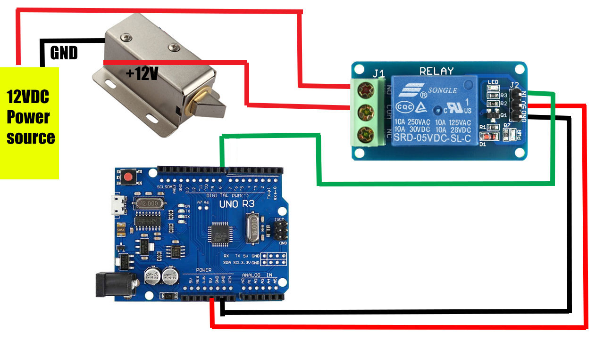
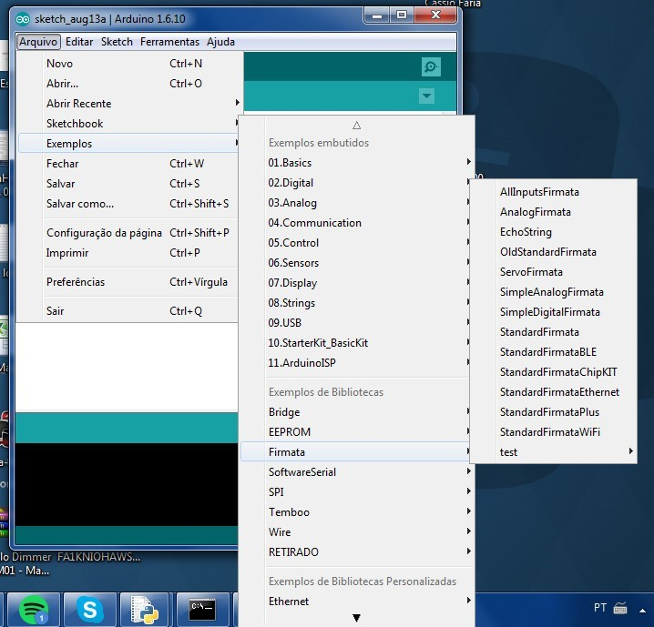

# Face Access
Access control (Arduino controled) with face recognition (On PC)
  * Multi Platform
  * MIT License
  * LGPDP Brasil Safe (Lei Geral de Proteção de Dados Pessoais)

### TODO List
- [x] Basic command line interface
- [x] Face recogniton from Webcam
- [x] Just use the photo once for register, after that discard. Save only a id on the local file database (LGPDP Brasil Safe).
- [x] OneTimePassword with Google Authenticator
- [x] Text to Speech for welcome audio message
- [x] Arduino commands to open the door
- [x] Qr-Code to easy registration and temporary access
- [ ] Audio code (CHIRP) to easy registration and temporary access
- [x] Use requirements.txt to Easy Install
- [x] Easy Install for Windows

### Improvements
- [x] Multithread support
- [x] GPU support
- [ ] Improve performance with Region Of Interest method (https://github.com/hrastnik/face_detect_n_track)
- [ ] Port to Raspberry Pi
- [ ] Refactoring (SOLID, and a good pattern at least)


*Easy QR-Code face register demonstration

# Technologies and Libraries
* [Python 3](https://www.python.org/)
* [OpenCV](https://opencv.org/)
* [dlib](http://dlib.net/)
* Face Recognition ([ageitgey](https://github.com/ageitgey/face_recognition))
* Arduino ([pyfirmata2](https://pypi.org/project/pyFirmata2))
* Fernet Cryptography ([cryptography](https://cryptography.io/en/latest))
* Google Text 2 Speech ([gTTS](https://pypi.org/project/gTTS))
* QR-Code ([pyZbar, pyqrcode, pypng](https://www.youtube.com/watch?v=1_q2dCphf50))
* Welcome synthesized audio ([pygame mixer](https://www.pygame.org))
* Audio-Code ([Chirp](https://developers.chirp.io/docs))

# Requirements
  * Python 3.6+
  * Cmake(Linux and Windows) or XCode (MacOS)
  * MacOS or Linux (Tested with Ubuntu 18.04).
    * Windows not officially supported by DLib and Face Recoginition library, but might work (slowly)
  * I strongly recommend that you use a package manager like Homebrew (MacOS), apt-get (Ubuntu) and Chocolatey (Windows)


# Easy install
You can copy and paste these commands to install all dependencies or going step-by-step in this tutorial to understand each part or if something not working.

*if **pip3** command not working use **pip** instead

**if something not work, try to reboot the terminal. :)

## MacOS
```bash
xcode-select --install
```
```bash
/usr/bin/ruby -e "$(curl -fsSL https://raw.githubusercontent.com/Homebrew/install/master/install)"
```
```bash
brew install git cmake python3 zbar portaudio libsndfile
```
```bash
git clone https://github.com/alexandremendoncaalvaro/face-access.git
cd face-access
```
```bash
pip3 install virtualenv
```
```bash
virtualenv cv
source cv/bin/activate
```
```bash
pip3 install -r requirements.txt
```
## Ubuntu
```bash
sudo apt update && sudo apt upgrade
```
```bash
sudo apt-get install git build-essential cmake python3 python3-pip libzbar-dev libzbar0 python3-dev python3-setuptools portaudio19-dev libffi-dev libsndfile1
```
```bash
git clone https://github.com/alexandremendoncaalvaro/face-access.git
cd face-access
```
```bash
pip3 install virtualenv
```
```bash
virtualenv cv && source cv/bin/activate
```
```bash
pip3 install -r requirements.txt
```
## Windows
```cmd
@"%SystemRoot%\System32\WindowsPowerShell\v1.0\powershell.exe" -NoProfile -InputFormat None -ExecutionPolicy Bypass -Command "iex ((New-Object System.Net.WebClient).DownloadString('https://chocolatey.org/install.ps1'))" && SET "PATH=%PATH%;%ALLUSERSPROFILE%\chocolatey\bin"
```
* Install Visual Studio **with Visual C++ Build Tools 2015**

  https://visualstudio.microsoft.com

```cmd
choco install git cmake python3 zbar -Y
```
```cmd
git clone https://github.com/alexandremendoncaalvaro/face-access.git &&
cd face-access
```
```cmd
pip3 install virtualenv
```
```cmd
virtualenv cv &&
cv\Scripts\activate
```
* Download sounddevice from the link below
https://www.lfd.uci.edu/~gohlke/pythonlibs/#sounddevice

* Example: sounddevice‑0.3.13‑**cp37**‑cp37m‑**win**_amd**64**.whl: For Python 3.7 and Windows 64 bits
* From the file path:
```cmd
pip3 install sounddevice_file_name.whl
```
* Replace the file name with the same of the downloaded file
```cmd
pip3 install -r requirements.txt
```

# Install (step-by-step)

## Package Manager installation
### Homebrew (Mac)
```bash
/usr/bin/ruby -e "$(curl -fsSL https://raw.githubusercontent.com/Homebrew/install/master/install)"
```
### Update apt (Ubuntu)
```bash
sudo apt update
sudo apt upgrade
```
### Chocolatey (Windows)
```cmd
@"%SystemRoot%\System32\WindowsPowerShell\v1.0\powershell.exe" -NoProfile -InputFormat None -ExecutionPolicy Bypass -Command "iex ((New-Object System.Net.WebClient).DownloadString('https://chocolatey.org/install.ps1'))" && SET "PATH=%PATH%;%ALLUSERSPROFILE%\chocolatey\bin"
```

## Cmake / XCode
### MacOS
* Install XCode from App Store

then:
```bash
xcode-select --install
```
```bash
brew install cmake
```
### Ubuntu
```bash
sudo apt install build-essential cmake
```

### Windows
* Install Visual Studio **with Visual C++ Build Tools 2015**

  https://visualstudio.microsoft.com

* install Cmake:
```cmd
choco install cmake -Y
```

Or manually install from: https://cmake.org/download/

*Add Cmake installation directory path to System path.
* [How to add directories to System path?](https://www.howtogeek.com/118594/how-to-edit-your-system-path-for-easy-command-line-access/)

## Python 3.6+ with PIP
*I strongly recomend you to know about (and maybe use) [Virtual Enviroments](https://www.geeksforgeeks.org/python-virtual-environment/)

*if **pip3** command not working use **pip** instead
### MacOS
```bash
brew install python3
```
*[more details..](https://wsvincent.com/install-python3-mac/)
### Ubuntu
```bash
sudo apt install python3 python3-pip
```
### Windows
```cmd
choco install python3 -Y
```

## Virtual Enviroments
*It's optional, but I strongly recomend you to know about (and use) [Virtual Enviroments](https://www.geeksforgeeks.org/python-virtual-environment/)

The **virtualenv** lib is a tool to create isolated Python environments. virtualenv creates a folder which contains all the necessary executables to use the packages that a Python project would need.

### pip command
```bash
pip3 install virtualenv
```
You can create a virtualenv using the following command (*choose a name, I used cv):
```bash
virtualenv cv
```
Activate it:
### MacOS & Ubuntu
```bash
source cv/bin/activate
```
### Windows
```cmd
cv\Scripts\activate
```

Now **ALL** pip libraries will be installed isolated inside the environment. It'll look like this:

**(cv)$ pip3 install ...**

If you want to deactivate:

**(cv)$ deactivate**

Command:
```bash
deactivate
```

## OpenCV
### pip command
```bash
pip3 install opencv-contrib-python
```
*[Complete Tutorial from pyimagesearch](https://www.pyimagesearch.com/2018/09/19/pip-install-opencv/)

## DLib + Face Recognition (ageitgey)  
### pip command
```bash
pip3 install dlib
```
*[How to install dlib from source on macOS or Ubuntu](https://gist.github.com/ageitgey/629d75c1baac34dfa5ca2a1928a7aeaf)

*How to install dlib from source on Windows: While Windows isn't officially supported, helpful users have posted instructions on how to install this library:
  * [@masoudr's Windows 10 installation guide (dlib + face_recognition)](https://github.com/ageitgey/face_recognition/issues/175#issue-257710508)
  
### pip command
```bash
pip3 install face_recognition
```
## Arduino control with pyFirmata2
You will need an Arduino Board like Uno, Mega, Micro, Nano with a relay module and a solenoid Door lock to control the access.



Install Arduino IDE and use the Example > Firmata > StandardFirmata on the board.



The board need to stay connected over USB.
All the Arduino (GPIO) control will be done by the python code.

This algorithm automatically detects the serial port of the Arduino.
If this fails you can also specify the serial port manually, for example:
board = Arduino('COM4')

Under Linux this is usually /dev/ttyUSB0. Under Windows this is a COM port, for example COM4. On a MAC it’s /dev/ttys000, /dev/cu.usbmodem14101 or check for the latest addition: ls -l -t /dev/*.

### pip command
```bash
pip3 install pyfirmata2
```

## Google Text 2 Speech
### pip command
```bash
pip3 install gTTS
```

## Google One Time Password (Google Authenticator)
### pip command
```bash
pip3 install pyotp
```

## QR-Code
### MacOS
```bash
brew install zbar
```
### Ubuntu
```bash
sudo apt-get install libzbar-dev libzbar0
```
### Windows
```cmd
choco install zbar -Y
```
### pip command
```bash
pip3 install pyzbar pyqrcode pypng
```

## Welcome Audio (Pygame Mixer)
### pip command
```bash
pip3 install pygame
```

## Audio Code - CHIRP
You will need generate keys to use this lib.
[Official instructions] (https://developers.chirp.io/docs/getting-started/python)

### MacOS
```bash
brew install portaudio libsndfile
```
### Ubuntu
```bash
sudo apt-get install python3-dev python3-setuptools portaudio19-dev libffi-dev libsndfile1
```
### Windows
* Download sounddevice from the link below
https://www.lfd.uci.edu/~gohlke/pythonlibs/#sounddevice

* Example: sounddevice‑0.3.13‑**cp37**‑cp37m‑**win**_amd**64**.whl: For Python 3.7 and Windows 64 bits
* From the file path:
```cmd
pip3 install sounddevice_file_name.whl
```
*Replace the file name with the same of the downloaded file

### pip command
```bash
pip3 install chirpsdk
```
# After installation
To start, with terminal go to folder path and execute:
```bash
python main.py
```

## Config file:
You can change a lot of configurations using config.py file

## CLI commands:
If everything is right, a new window with the webcam streaming and face recognition will start.
In the terminal you should see somethong like: 

**CMD:**

*Don't use spaces **BETWEEN** parameters, they are separated by comma (,). But you can use spaces **IN** parameter, like: Firstname Middlename Lastname..

### Where you can do some actions like:
**Create a QR-Code to show to the camera and easelly register a new face:**
```bash
qr,Joseph Smith
```
**Add a new face id from a image file in the folder images:**
```bash
add,Joseph Smith,images/joseph.jpg
```
**Add a new face id from the current webcam capture:**
```bash
add,Joseph Smith
```
**List the current face ids:**
```bash
print
```
**Remove a face id:**
```bash
del,Joseph Smith
```
**Exit:**
```bash
q
```
or
```bash
quit
```

# Are you a native english speaker?
No, I am not. If you find typos, grammar errors or whatever please feel free to PR or tell me.